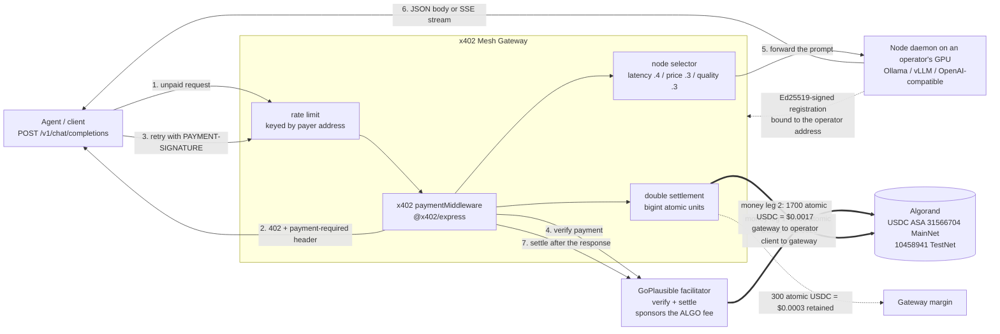

# x402 Mesh Inference

**A decentralized pay-per-prompt AI inference marketplace.** Independent GPU operators register
their hardware with a gateway, an autonomous agent calls an ordinary OpenAI-compatible
`POST /v1/chat/completions` endpoint with no account and no API key, and the gateway answers
`402 Payment Required` with a machine-readable x402 challenge. The agent pays **$0.0020 USDC**
inline — settled on **Algorand** through the [GoPlausible](https://facilitator.goplausible.xyz)
x402 facilitator, which sponsors the ALGO fee so the payment is gasless for the payer — the
gateway routes the prompt to the healthiest node advertising that model, streams the completion
back over SSE, and then pays that node's operator **$0.0017 USDC** on chain, keeping **$0.0003**
as margin. Two on-chain money legs per request, both in integer atomic units, with the invariant
`inbound − payout = margin` asserted before any funds move.

- **Protocol** x402 v2, `exact` scheme, `@x402/*@2.20.0` with `@x402/avm` (Algorand, authored by
  GoPlausible)
- **Chains** Algorand MainNet and TestNet — USDC ASA `31566704` / `10458941`, 6 decimals
- **Discovery** `/.well-known/x402`, `/llms.txt`, and the Bazaar extension carrying the
  `x402-global-challenge` tag
- **License** Apache-2.0

---

## Contents

- [How it works](#how-it-works)
- [The money, step by step](#the-money-step-by-step)
- [Quickstart](#quickstart)
- [Node operator guide](#node-operator-guide)
- [Configuration reference](#configuration-reference)
- [API reference](#api-reference)
- [Agent discovery](#agent-discovery)
- [Repository layout](#repository-layout)
- [Testing and CI](#testing-and-ci)
- [Security notes](#security-notes)
- [Algorand x402 Global Challenge submission](#algorand-x402-global-challenge-submission)

---

## How it works



The two thick edges are the money. Everything else is plain HTTP.

## The money, step by step

USDC on Algorand has **6 decimals**, so every amount below is an exact integer of atomic units.
The gateway never performs floating-point arithmetic on an amount — all three legs are `bigint`.

| Leg                     | Display | Atomic units | Where it is computed                                  |
| ----------------------- | ------- | -----------: | ----------------------------------------------------- |
| Client → gateway        | $0.0020 |       `2000` | `MESH_INBOUND_PRICE_USDC`, settled by the facilitator |
| Gateway → node operator | $0.0017 |       `1700` | `computeSplit()`, paid by the gateway wallet          |
| Gateway margin          | $0.0003 |        `300` | `MESH_MARGIN_BPS=1500` (15% of 2000, floors to 300)   |

1. **Unpaid call.** The agent `POST`s a normal OpenAI-shaped body to `/v1/chat/completions` with
   no payment header.
2. **402 challenge.** The gateway replies `402 Payment Required`. The machine-readable
   requirement travels in the **`payment-required` response header** (base64 JSON) — that is
   where `accepts[]` lives in x402 v2. The JSON _body_ is a human- and agent-readable preview:
   price, network, `payTo`, facilitator, a runnable example request, and `howToPay`.
3. **Payment.** The agent retries with a `PAYMENT-SIGNATURE` header carrying an
   `ExactAvmPayloadV2` — a base64 msgpack atomic transaction group plus the index of the USDC
   transfer leg. The facilitator's fee-payer transaction is in the same group, which is what
   makes the payment gasless for the agent: it signs only the ASA transfer.
4. **Verify.** `paymentMiddleware` calls the facilitator's `/verify` before the handler runs.
   Nothing is charged yet.
5. **Route.** The selector ranks healthy nodes advertising the requested model. Latency, price
   and quality are each normalized to `[0, 1]` **against the current candidate set** before being
   mixed (weights `0.4 / 0.3 / 0.3`), so the ranking is scale-invariant. The chosen node is
   echoed as `x-mesh-node-id`.
6. **Infer.** The gateway proxies to the node. `"stream": true` gets a `text/event-stream` of
   `chat.completion.chunk` frames terminated by the literal `data: [DONE]`.
7. **Settle inbound.** After the handler returns, the middleware calls `/settle`. Leg 1 lands on
   chain: `2000` atomic USDC from the client to `X402_PAY_TO_ADDRESS`.
8. **Pay the operator.** `onAfterSettle` fires — only on _confirmed_ settlement, never on mere
   verification — and hands `x-request-id` + `x-mesh-node-id` to the settlement service. It
   recomputes the split, re-asserts `inbound − payout === margin`, and pays leg 2: `1700` atomic
   USDC to the operator's address, with three attempts of jittered exponential backoff.
9. **Audit.** Every request lands in the ledger at `GET /v1/settlements`, with all three legs, the
   inbound and payout transaction ids, and a terminal `settled` / `failed` status.

Two properties are worth calling out because they are easy to get wrong:

- The payout is **idempotent**. A request id that has entered the payout path can never enter it
  again, and the claim is made in the same synchronous turn as the decision to pay.
- The payout can never break the client. `settleInbound` returns `void` and swallows its own
  failures into a ledger entry and an `OPERATOR ALERT` log line — the client has already been
  served by then, and a payout failure must not retroactively look like a payment failure.

## Quickstart

### Prerequisites

- Node.js **≥ 20.11** (CI runs 20.11 and 22)
- Docker with Compose v2, for the one-command demo
- An Algorand account with a little ALGO, **opted in to USDC** — see
  [Node operator guide](#node-operator-guide). For a local demo the opt-in requirement is
  switched off, so you can start without one.

### Option A — the whole loop in one command

Generate an Algorand account (the address goes to the gateway, the secret to the demo node):

```bash
npm run keygen -- --network testnet
```

Copy the example environment and fill in the two values the demo requires:

```bash
cp .env.example .env
```

Set `X402_PAY_TO_ADDRESS` to the printed address and `AVM_PRIVATE_KEY` to the printed secret,
then bring the stack up from the repository root:

```bash
docker compose --env-file .env -f docker/docker-compose.yml up --build
```

> `--env-file .env` is not optional. Compose resolves `${VAR}` interpolation against the
> directory of the compose file, so without it the root `.env` is invisible and the run fails
> with `required variable X402_PAY_TO_ADDRESS is missing a value`.

That starts Redis, Ollama, a model pull (`llama3.2:1b` by default — override with
`MESH_DEMO_MODEL`), the gateway on `http://127.0.0.1:8402`, and one node daemon. Everything binds
to loopback.

Check it is alive and see the price it is charging:

```bash
curl -s http://127.0.0.1:8402/healthz
```

```bash
curl -s http://127.0.0.1:8402/.well-known/x402
```

```bash
curl -s -i -X POST http://127.0.0.1:8402/v1/chat/completions \
  -H 'content-type: application/json' \
  -d '{"model":"llama3.2:1b","messages":[{"role":"user","content":"hello"}]}'
```

The last command returns `402` with the `payment-required` header — that is the system working.

Tear it down with:

```bash
docker compose --env-file .env -f docker/docker-compose.yml down -v
```

### Option B — from source

```bash
npm run build
```

```bash
npm run verify
```

Run the gateway (only `X402_PAY_TO_ADDRESS` is mandatory; everything else has a default):

```bash
X402_PAY_TO_ADDRESS=<your 58-char Algorand address> \
MESH_NETWORK=testnet \
MESH_REQUIRE_USDC_OPT_IN=false \
npm run dev:gateway
```

In a second terminal, prove the whole loop end to end with no chain, no funds and no network —
it boots a stub gateway and a mock inference node in-process and asserts
402 → pay → route → stream → split:

```bash
npx tsx scripts/e2e-simulate.ts
```

Point the same harness at the gateway you just started:

```bash
MESH_E2E_BASE_URL=http://127.0.0.1:8402 npx tsx scripts/e2e-simulate.ts
```

Before pointing anything real at a deployment, run the preflight — it checks the config loads,
the price split is exact, the facilitator is live and advertises your network, the USDC asset id
resolves, and (unless `--skip-chain`) that your `payTo` account is funded and opted in:

```bash
npm run preflight
```

## Node operator guide

You are contributing a GPU and getting paid `1700` atomic USDC (`$0.0017`) per request you serve.
Five steps, and **step 3 is the one that silently breaks payouts if you skip it.**

### 1. Generate an operator key

```bash
npm run keygen -- --network testnet
```

Prints an `ADDRESS` and an `AVM_PRIVATE_KEY` (base64 of the 64-byte Algorand secret key: a
32-byte Ed25519 seed followed by the 32-byte public key). Nothing is written to disk. The secret
signs your registrations and heartbeats **and** is the address that receives payouts — treat it
like money, because it is.

### 2. Fund it with ALGO

Algorand enforces a **Minimum Balance Requirement**: **0.1 ALGO** per account, **plus 0.1 ALGO
for every ASA the account has opted into**. Keep at least **0.3 ALGO** so the floor and
transaction fees are both covered.

- TestNet ALGO faucet: <https://lora.algokit.io/testnet/fund>
- TestNet/MainNet USDC faucet: <https://faucet.circle.com/>

### 3. Opt in to the USDC ASA — do not skip this

**An Algorand account cannot receive an asset it has not opted into.** A payout to a
non-opted-in address fails on chain _after the client has already been charged_, which is why
this is the number one silent payout failure and why the gateway refuses to route to a node that
has not done it (`MESH_REQUIRE_USDC_OPT_IN=true` by default).

An opt-in is simply a **zero-amount asset transfer from the account to itself**.

| Network | USDC ASA id |
| ------- | ----------- |
| MainNet | `31566704`  |
| TestNet | `10458941`  |

Easiest route: open <https://lora.algokit.io/testnet/>, connect the account, then
**Assets → Opt in →** the asset id above. Pera and Defly wallets do the same thing.

### 4. Diagnose before you register

```bash
AVM_PRIVATE_KEY=<base64 secret> \
MESH_GATEWAY_URL=http://127.0.0.1:8402 \
MESH_NODE_ID=gpu-local-01 \
MESH_NODE_ENDPOINT=http://127.0.0.1:8500 \
MESH_MODELS=llama3.1:8b \
npx tsx packages/node-daemon/src/cli.ts doctor
```

`doctor` checks, in order: configuration, operator key, inference backend reachability, that the
models you advertise actually exist on that backend, gateway reachability, that the account is
funded above its minimum balance, and **that it is opted in to USDC**. It exits `1` if any check
fails. `--offline` skips every network check; `--algod-url <url>` points the chain reads at your
own algod instead of the public AlgoNode endpoint.

To print just the address your key derives to (never the key itself):

```bash
npx tsx packages/node-daemon/src/cli.ts address --quiet
```

### 5. Register and serve

```bash
npx tsx packages/node-daemon/src/cli.ts start
```

`start` registers with the gateway, begins the signed heartbeat loop, and serves inference. Add
`--port`, `--host`, `--log-level`, or `--no-register` if the node is already registered. Capability
flags (`--context-window`, `--price`, `--quantization`) are shared by `register` and `start`; the
price flag takes a decimal USDC string per 1000 tokens and is validated by the same money
validator as everything else — never `parseFloat`.

From a built checkout the same commands are available as
`npm run start --workspace @x402-mesh/node-daemon -- <command>`, and the published binary name is
`x402-mesh-node`.

### The daemon CLI, verbatim

```text
Usage: x402-mesh-node [options] [command]

x402 Mesh node daemon: register a GPU with the mesh gateway, prove liveness with
signed heartbeats, and serve paid inference.

Options:
  -v, --version       print the daemon version
  -h, --help          display help for command

Commands:
  register [options]  register this node with the gateway once, then exit
  start [options]     register, start the signed heartbeat and serve inference
  doctor [options]    diagnose this node's configuration, backend, key and
                      on-chain prerequisites
  address [options]   print the operator address derived from AVM_PRIVATE_KEY
                      (never the key)
  help [command]      display help for command

Environment (required):
  MESH_GATEWAY_URL       base URL of the mesh gateway
  MESH_NODE_ID           stable id for this node, unique within the mesh
  MESH_NODE_ENDPOINT     absolute URL the gateway forwards inference to
  MESH_MODELS            comma-separated models this node serves
  AVM_PRIVATE_KEY        base64 of the 64-byte Algorand secret key (never a flag)

Environment (optional):
  MESH_PROVIDER          ollama | vllm | openai            (default: ollama)
  MESH_PROVIDER_BASE_URL backend base URL                  (default: per provider)
  MESH_PROVIDER_API_KEY  bearer token for the backend, if it needs one
  MESH_NETWORK           mainnet | testnet                 (default: testnet)
  MESH_MAX_CONCURRENCY   concurrent requests before 503    (default: 8)
  MESH_HEARTBEAT_INTERVAL_MS                               (default: 15000)
  MESH_NODE_AUTH_TOKEN   bearer token the gateway must present on POST /infer

Run `x402-mesh-node doctor` first: it checks the backend, the key, the gateway and
the on-chain USDC opt-in that payouts depend on.
```

## Configuration reference

Every variable is validated at startup, and a bad value fails loudly with the variable named —
never silently coerced. Values are never echoed into an error message, and `errors.ts` redacts
any detail key matching `key|secret|token|password|passphrase|mnemonic|auth|credential`.

### Gateway

Loaded by `loadGatewayConfig()` in `packages/shared/src/config.ts`.

| Variable                            | Req |                  Default | Secret | Notes                                                                                               |
| ----------------------------------- | :-: | -----------------------: | :----: | --------------------------------------------------------------------------------------------------- |
| `X402_PAY_TO_ADDRESS`               | ✅  |                        — |        | 58-char Algorand address that receives client payments. Opt in to USDC.                             |
| `PORT`                              |     |                   `8402` |        | 1–65535.                                                                                            |
| `HOST`                              |     |                `0.0.0.0` |        | Bind address.                                                                                       |
| `MESH_NETWORK`                      |     |                `testnet` |        | `mainnet` \| `testnet`.                                                                             |
| `X402_NETWORK`                      |     |       derived from above |        | Explicit CAIP-2 override; either encoding. Disagreeing with `MESH_NETWORK` is a startup error.      |
| `X402_FACILITATOR_URL`              |     |  GoPlausible facilitator |        | `https://facilitator.goplausible.xyz`.                                                              |
| `MESH_INBOUND_PRICE_USDC`           |     |                 `0.0020` |        | Decimal string, ≤ 6 dp. `0.0020` = `2000` atomic.                                                   |
| `MESH_MARGIN_BPS`                   |     |                   `1500` |        | 0–10000. 1500 bps on 2000 atomic = 300 margin, 1700 payout, no rounding.                            |
| `MESH_PUBLIC_BASE_URL`              |     | `http://localhost:$PORT` |        | Must be the URL clients actually reach; it is baked into challenges and the manifest.               |
| `REDIS_URL`                         |     |        unset → in-memory |        | Node registry + settlement ledger backend.                                                          |
| `MESH_REQUIRE_USDC_OPT_IN`          |     |                   `true` |        | When true, a node whose operator has not opted in is stored but never routed to.                    |
| `MESH_ALLOW_PRIVATE_NODE_ENDPOINTS` |     |                  `false` |        | Allow node endpoints on private/loopback/link-local addresses. **Local dev only** — see SSRF notes. |
| `MESH_NODE_REQUEST_TIMEOUT_MS`      |     |                 `120000` |        | 1000–600000.                                                                                        |
| `MESH_MAX_CONCURRENT_PER_NODE`      |     |                      `8` |        | 1–1024.                                                                                             |
| `LOG_LEVEL`                         |     |                   `info` |        | `fatal\|error\|warn\|info\|debug\|trace\|silent`.                                                   |
| `OTEL_ENABLED`                      |     |                  `false` |        | OpenTelemetry tracing.                                                                              |
| `OTEL_EXPORTER_OTLP_ENDPOINT`       |     |                    unset |        | Only read when `OTEL_ENABLED` is true.                                                              |
| `X402_CHALLENGE_TAG`                |     |  `x402-global-challenge` |        | Emitted first in `tags` so the Bazaar's 5-tag cap can never drop it.                                |

Read **directly** by `packages/gateway/src/server.ts` and `services/algorand.ts`, not by
`loadGatewayConfig()` — and, at time of writing, **not documented in `.env.example`** except for
`ALGOD_TOKEN`:

| Variable          | Req |         Default | Secret | Notes                                                                                                                                |
| ----------------- | :-: | --------------: | :----: | ------------------------------------------------------------------------------------------------------------------------------------ |
| `AVM_PRIVATE_KEY` |     |           unset |   🔑   | The gateway's **payout wallet**. Without it the gateway still takes payment but every operator payout is recorded as failed, loudly. |
| `ALGOD_SERVER`    |     | AlgoKit default |        | algod host override for opt-in checks and payouts.                                                                                   |
| `ALGOD_PORT`      |     | AlgoKit default |        |                                                                                                                                      |
| `ALGOD_TOKEN`     |     |           unset |   🔑   | `X-Algo-API-Token` for a private algod. Public AlgoNode needs none.                                                                  |

### Node daemon

Loaded by `loadDaemonConfig()` in `packages/shared/src/config.ts`.

| Variable                     | Req |            Default | Secret | Notes                                                                                                                                                                                                    |
| ---------------------------- | :-: | -----------------: | :----: | -------------------------------------------------------------------------------------------------------------------------------------------------------------------------------------------------------- |
| `MESH_GATEWAY_URL`           | ✅  |                  — |        | Base URL of the gateway to register with.                                                                                                                                                                |
| `MESH_NODE_ID`               | ✅  |                  — |        | Unique in the mesh. `^[A-Za-z0-9][A-Za-z0-9._:-]*$`, ≤ 128 chars.                                                                                                                                        |
| `MESH_NODE_ENDPOINT`         | ✅  |                  — |        | Absolute http(s) URL the gateway forwards to. Must be reachable **from the gateway**.                                                                                                                    |
| `MESH_MODELS`                | ✅  |                  — |        | Comma-separated, 1–64 entries, whitespace trimmed.                                                                                                                                                       |
| `AVM_PRIVATE_KEY`            | ✅  |                  — |   🔑   | Base64 of the 64-byte Algorand secret key. Signs registrations and heartbeats; derives the payout address. Deliberately has **no CLI flag** — a key on a command line ends up in shell history and `ps`. |
| `MESH_PROVIDER`              |     |           `ollama` |        | `ollama` \| `vllm` \| `openai`.                                                                                                                                                                          |
| `MESH_PROVIDER_BASE_URL`     |     |     per provider ¹ |        |                                                                                                                                                                                                          |
| `MESH_NETWORK`               |     |          `testnet` |        | Must match the gateway, or registration is rejected.                                                                                                                                                     |
| `X402_NETWORK`               |     | derived from above |        | Same override semantics as the gateway.                                                                                                                                                                  |
| `MESH_HEARTBEAT_INTERVAL_MS` |     |            `15000` |        | 1000–600000.                                                                                                                                                                                             |
| `MESH_MAX_CONCURRENCY`       |     |                `8` |        | 1–1024. Beyond it the node answers `503` with `Retry-After`.                                                                                                                                             |

¹ `ollama` → `http://127.0.0.1:11434`, `vllm` → `http://127.0.0.1:8000`, `openai` →
`https://api.openai.com`.

Read directly by `packages/node-daemon/src/cli.ts` (secrets are taken from the environment only,
never from `argv`) and **not documented in `.env.example`**:

| Variable                | Req | Default | Secret | Notes                                                                                             |
| ----------------------- | :-: | ------: | :----: | ------------------------------------------------------------------------------------------------- |
| `MESH_PROVIDER_API_KEY` |     |   unset |   🔑   | Bearer token for the inference backend, if it needs one.                                          |
| `MESH_NODE_AUTH_TOKEN`  |     |   unset |   🔑   | Bearer the caller must present on `POST /infer`. See [known gaps](#known-gaps) before setting it. |

### Scripts and the compose demo

Not read by the services themselves.

| Variable               | Used by                                 | Secret | Notes                                                                              |
| ---------------------- | --------------------------------------- | :----: | ---------------------------------------------------------------------------------- |
| `ALGOD_URL`            | `scripts/lib/algod.ts` (preflight, e2e) |        | Defaults to public AlgoNode for the network.                                       |
| `ALGOD_TOKEN`          | same                                    |   🔑   | `X-Algo-API-Token`; only sent when set.                                            |
| `MESH_E2E_BASE_URL`    | `e2e-simulate.ts`, `e2e-mainnet.ts`     |        | Unset in `e2e-simulate` runs the built-in stub gateway. Required by `e2e-mainnet`. |
| `MESH_E2E_MODEL`       | both e2e harnesses                      |        | Unset auto-detects from a healthy node.                                            |
| `X402_MAINNET_CONFIRM` | `e2e-mainnet.ts`                        |        | Safety interlock — see below.                                                      |
| `MESH_DEMO_MODEL`      | `docker/docker-compose.yml`             |        | Default `llama3.2:1b`.                                                             |
| `NO_COLOR`, `TERM`     | `scripts/lib/cli.ts`                    |        | Disable ANSI colour.                                                               |

## API reference

Base URL is `MESH_PUBLIC_BASE_URL` (locally `http://127.0.0.1:8402`). The full contract is in
[`spec/openapi.yaml`](spec/openapi.yaml) — 8 paths, 8 operations, validated in CI.

| Method | Path                           |     Cost | Purpose                                                                       |
| ------ | ------------------------------ | -------: | ----------------------------------------------------------------------------- |
| `POST` | `/v1/chat/completions`         | **paid** | OpenAI-compatible completion. `"stream": true` for SSE.                       |
| `POST` | `/v1/nodes/register`           |     free | Signed operator registration.                                                 |
| `POST` | `/v1/nodes/{nodeId}/heartbeat` |     free | Liveness and load report.                                                     |
| `GET`  | `/v1/nodes`                    |     free | Public node listing: models, health, routability.                             |
| `GET`  | `/v1/settlements`              |     free | Settlement ledger + live economics. `?limit=` 1–1000, default 100.            |
| `GET`  | `/healthz`                     |     free | Liveness. Touches **nothing** external, by design.                            |
| `GET`  | `/readyz`                      |     free | Readiness: facilitator, store and payout-wallet checks. `503` when not ready. |
| `GET`  | `/.well-known/x402`            |     free | Discovery manifest.                                                           |
| `GET`  | `/llms.txt`                    |     free | Agent-readable service description.                                           |
| `GET`  | `/static/icon.svg`             |     free | Service icon referenced by the Bazaar `iconUrl`.                              |

The free surface is mounted **before** the paywall in `app.ts`, so no configuration mistake can
start charging for discovery or a health check. There is exactly one paid route.

### A real 402 challenge

Shape and field values captured from the running gateway on TestNet. Three values are shown as
they would appear in a real deployment rather than as the test fixture emitted them: `payTo` is
the documented placeholder address, `feePayer` is GoPlausible's live sponsor account, and
`maxTimeoutSeconds` is what the default 120 s upstream timeout produces. The requirement lives in
the **`payment-required` header**; the body is the readable companion.

```http
HTTP/1.1 402 Payment Required
content-type: application/json; charset=utf-8
x-request-id: 6f131075-afb0-42b6-9f8d-cbcc6d000ff6
x-ratelimit-limit: 60
x-ratelimit-remaining: 59
payment-required: eyJ4NDAyVmVyc2lvbiI6MiwiZXJyb3IiOiJQYXltZW50IHJlcXVpcmVkIiwi…
```

`payment-required`, base64-decoded (`decodePaymentRequiredHeader` from `@x402/core/http`):

```json
{
  "x402Version": 2,
  "error": "Payment required",
  "resource": {
    "url": "https://mesh.example.com/v1/chat/completions",
    "description": "Pay-per-prompt OpenAI-compatible chat completions routed across a mesh of independent GPU nodes, settled in USDC on Algorand via x402.",
    "mimeType": "application/json",
    "serviceName": "x402 Mesh Inference",
    "tags": ["x402-global-challenge", "ai-inference", "llm", "openai-compatible", "algorand"],
    "iconUrl": "https://mesh.example.com/static/icon.svg"
  },
  "accepts": [
    {
      "scheme": "exact",
      "network": "algorand:SGO1GKSzyE7IEPItTxCByw9x8FmnrCDe",
      "amount": "2000",
      "asset": "10458941",
      "payTo": "MESHA65YISXOIW6STKMGJ5AFBZK2UJQNHR3LQZPG2LHIRB4YBPFJPT5WGU",
      "maxTimeoutSeconds": 180,
      "extra": { "feePayer": "ZMFK2OI7ZBD2U27ISERZC4S6LKM6WMFJPZQ4MYNJDZ2VNBNMBA67RA22AA" }
    }
  ],
  "extensions": { "bazaar": { "info": { "input": { "…": "runnable example request" } } } }
}
```

Reading that field by field:

- `network` is the **canonical, truncated** Algorand CAIP-2 id — the first 32 characters of the
  url-safe base64 genesis hash. TestNet is `algorand:SGO1GKSzyE7IEPItTxCByw9x8FmnrCDe`; MainNet
  is `algorand:wGHE2Pwdvd7S12BL5FaOP20EGYesN73k`. The facilitator advertises the _padded_ form of
  the same ids; both are accepted and normalized at the boundary, never string-compared raw.
- `asset` is the USDC ASA id for that network (`10458941` TestNet, `31566704` MainNet), read from
  `avm.USDC_CONFIG` rather than hardcoded so a network switch cannot desync it.
- `amount` is **integer atomic units as a string** — `"2000"`, not `0.002`.
- `maxTimeoutSeconds` is derived: `max(60, ceil(nodeRequestTimeoutMs / 1000) + 60)`, so `180` with
  the default 120 s upstream timeout. It must exceed how long the gateway may hold a request, or a
  slow-but-successful inference would settle against an expired authorization.
- `extra.feePayer` is the facilitator's sponsor account. It is why the payment is gasless for the
  client.

Body of the same response (abridged):

```json
{
  "service": "x402 Mesh Inference",
  "price": {
    "usdc": "0.0020",
    "display": "$0.0020",
    "atomic": "2000",
    "asset": "10458941",
    "decimals": 6,
    "per": "request"
  },
  "network": "algorand:SGO1GKSzyE7IEPItTxCByw9x8FmnrCDe",
  "meshNetwork": "testnet",
  "payTo": "MESHA65YISXOIW6STKMGJ5AFBZK2UJQNHR3LQZPG2LHIRB4YBPFJPT5WGU",
  "facilitator": "https://facilitator.goplausible.xyz",
  "scheme": "exact",
  "howToPay": [
    "Retry this request with an `x402` client configured for the Algorand `exact` scheme.",
    "The facilitator sponsors the ALGO fee, so you only sign the USDC asset transfer.",
    "Your paying account must be opted in to the USDC ASA before the transfer can land."
  ],
  "models": { "discovery": "https://mesh.example.com/v1/nodes", "example": "llama3.1:8b" },
  "exampleRequest": { "…": "a request that works verbatim once paid" },
  "documentation": "https://mesh.example.com/llms.txt"
}
```

### Response headers on a served request

| Header                                        | Meaning                                                          |
| --------------------------------------------- | ---------------------------------------------------------------- |
| `x-request-id`                                | Correlation id shared by logs, traces and the settlement record. |
| `x-mesh-node-id`                              | Which operator served you — and how the payout leg finds them.   |
| `x-mesh-route-reason`                         | `attempts=<n> latency=<ms>ms`, on non-streaming responses.       |
| `x-ratelimit-limit` / `x-ratelimit-remaining` | Token-bucket state for your key.                                 |
| `payment-response`                            | Set by the x402 middleware once the inbound payment settles.     |

### Error codes

Every error is `{ "error": { "code", "message", "details"? } }`. Codes are a stable contract.

| Code               | HTTP  | When                                                             |
| ------------------ | ----- | ---------------------------------------------------------------- |
| `validation_error` | `400` | Schema or freshness validation failed.                           |
| `auth_error`       | `401` | Ed25519 signature failed, or the key does not match the address. |
| `payment_error`    | `402` | Payment missing, malformed, or rejected.                         |
| `rate_limited`     | `429` | Token bucket empty. Carries `Retry-After`.                       |
| `no_capacity`      | `503` | No healthy node advertises the requested model.                  |
| `upstream_error`   | `502` | A node or the facilitator returned something unusable.           |
| `settlement_error` | `502` | An on-chain leg failed.                                          |
| `config_error`     | `500` | Invalid configuration.                                           |
| `pricing_error`    | `500` | A split violated `inbound === payout + margin`.                  |
| `internal_error`   | `500` | Anything else. Body is generic — no stack, no details.           |

### Node daemon HTTP surface

The daemon serves two routes on `MESH_NODE_ENDPOINT`:

| Method | Path      | Purpose                                                                                                                                                                         |
| ------ | --------- | ------------------------------------------------------------------------------------------------------------------------------------------------------------------------------- |
| `GET`  | `/health` | Backend health, models, `inFlight` / `maxConcurrency` / `available`.                                                                                                            |
| `POST` | `/infer`  | Run a completion. `503` + `Retry-After` when the concurrency semaphore is full; `401` when `MESH_NODE_AUTH_TOKEN` is set and the bearer does not match (constant-time compare). |

## Agent discovery

An agent that has never heard of this service needs to find it, learn the price, and construct a
paid request — without a human in the loop. Three surfaces do that.

**`GET /.well-known/x402`** — the x402 discovery manifest. It is rendered from **live
configuration** at request time, not served as a static file: `spec/well-known-x402.json` acts as
a _template_ whose prose and schema survive, while every payment-bearing field (`network`,
`asset`, `amount`, `payTo`, `maxTimeoutSeconds`) and the tag list are overwritten with what the
gateway is actually running. A manifest advertising a stale `payTo` would send money to the wrong
account, so the deployment always wins over the checked-in file.

**`GET /llms.txt`** — plain-text description written for crawlers and agents, with a
`## Live configuration` block appended from the running gateway so the served copy can never
disagree with it.

**The Bazaar extension** — `declareDiscoveryExtension()` from `@x402/extensions/bazaar` is
attached to the paid route's `extensions` (assigned _directly_: the helper already returns a
record keyed `{ bazaar: … }`, and re-wrapping it produces `{ bazaar: { bazaar: … } }` and silently
de-lists the route). `method` is deliberately omitted — the server extension fills it from the
route key, and passing it is a type error. The declaration carries a realistic, runnable example
request and response rather than a schema sketch, so an agent can go from catalog entry to paid
call with nothing else.

**The `x402-global-challenge` tag is mandatory** and lives in `RouteConfig.tags`. The Bazaar
sanitizer keeps at most the **first five** tags and drops the rest with no diagnostic, so the
challenge tag is always emitted **first**:

```text
x402-global-challenge, ai-inference, llm, openai-compatible, algorand
```

Its presence is asserted three ways: in the gateway's own test suite, by
`npx tsx scripts/validate-spec.ts` (which runs the tag list through the SDK's real `sanitizeTags`),
and by the deploy workflow against the **served** manifest of a live deployment.

## Repository layout

```text
packages/
  shared/       money (bigint atomic units), pricing split, zod schemas, canonical
                signing, CAIP-2 network normalization, config loaders, error taxonomy
  registry/     node store (in-memory + Redis) and the scale-invariant node selector
  gateway/      Express app: x402 paywall, node lifecycle, routing, SSE relay,
                double settlement, discovery, health, telemetry
  node-daemon/  the `x402-mesh-node` CLI operators run: register, start, doctor, address
spec/           openapi.yaml, well-known-x402.json, llms.txt  (contract artefacts)
scripts/        keygen, preflight, validate-spec, e2e-simulate, e2e-mainnet
docker/         Dockerfile.gateway, Dockerfile.node-daemon, docker-compose.yml
docs/           x402-integration-notes.md — empirically verified protocol ground truth
```

`docs/x402-integration-notes.md` is worth reading before touching the payment path. Every value
in it was verified against the published `@x402/*@2.20.0` type definitions and a live probe of
the facilitator; the protocol post-dates most model training data, and guessed identifiers fail
_silently_ at settlement.

## Testing and CI

### The verify gate

```bash
npm run verify
```

Runs `format:check` → `lint` → `typecheck` → `test`. `typecheck` is three passes: the package
project references, `tsconfig.tests.json` (so **tests are typechecked under the same strict
flags** as source), and `scripts/tsconfig.json`.

Useful individually:

```bash
npm run test:coverage
```

```bash
npx tsx scripts/validate-spec.ts
```

```bash
npx tsx scripts/e2e-simulate.ts
```

### Workflows

| Workflow                  | What it does                                                                                                                                                                                                                                                                                                                                                                                                                                                                                                                                                   |
| ------------------------- | -------------------------------------------------------------------------------------------------------------------------------------------------------------------------------------------------------------------------------------------------------------------------------------------------------------------------------------------------------------------------------------------------------------------------------------------------------------------------------------------------------------------------------------------------------------- |
| `ci-test.yml`             | Verify gate on Node 20.11 and 22 (`fail-fast: false`), plus build, spec validation, the stub-mode e2e, `--help` on every operator script, and two **guard assertions**: `e2e-mainnet.ts` must exit `2` without confirmation, and `preflight.ts` must exit `1` on an unconfigured environment. A separate `coverage` job uploads lcov and reports to Codecov only when a token exists, so forks stay green.                                                                                                                                                     |
| `e2e-x402-simulation.yml` | Two jobs. `simulate` runs the 402 → pay → route → stream → split loop fully in-process — no services, no secrets, no chain — and must pass on every PR including from forks. `gateway-e2e` boots the real gateway against real Redis and a throwaway algod, registers a mock inference node, and drives the same assertions over HTTP. With `AVM_PRIVATE_KEY` present it pays through the real facilitator and asserts the ledger shows exactly `2000 = 1700 + 300`; without it the paid legs are reported as skipped and the run is honestly green.           |
| `deploy.yml`              | Manual dispatch, or automatically after `ci-test` goes green on `main` (via `workflow_run`, so only a commit whose tests passed is ever deployed). Builds and pushes both images to GHCR with provenance and SBOM, smoke-tests the gateway image against `/healthz`, then optionally calls an HTTPS deploy hook and verifies the live `/readyz` and the **served** discovery manifest — including the challenge tag, the `exact` scheme, an `algorand:` network and an integer `amount`. Every deployment secret is optional; unset ones produce a clean skip. |

### Coverage — stated honestly

Numbers move as the suite grows, so verify rather than trust this section:

```bash
npm run test:coverage
```

At the time of writing that reports **574 tests across 30 files, all passing**, and **84.5% line
coverage** overall:

| Package       | Line coverage | What that means                                                                                                                             |
| ------------- | ------------: | ------------------------------------------------------------------------------------------------------------------------------------------- |
| `registry`    |     **96.5%** | Node store (in-memory **and** Redis, against a stub client), scoring and selection.                                                         |
| `shared`      |     **95.7%** | Money, pricing, schemas, canonical signing, network normalization, config loaders, error taxonomy. This is the code that must not be wrong. |
| `gateway`     |     **80.8%** | Paywall, discovery, node registration, routing, SSE relay, settlement, rate limiting.                                                       |
| `node-daemon` |     **80.8%** | Keys, canonical signing, registration, heartbeat loop, provider adapters, HTTP server, SSE, semaphore.                                      |

What is **not** covered is worth naming precisely, because a headline percentage hides it. These
files are at or near 0%:

- `packages/gateway/src/server.ts` and `packages/gateway/src/services/algorand.ts` — process
  bootstrap and the live algod/AlgoKit client. Exercised by the e2e workflow, not by unit tests.
- `packages/node-daemon/src/cli.ts` and `src/commands/*` — commander wiring and the `doctor`
  command surface. The logic they call (`doctor.ts`, `registration.ts`, `server.ts`) is covered;
  the argv plumbing is checked only by the `--help` step in CI.
- `packages/gateway/src/telemetry/otel.ts` (~47%) — the OpenTelemetry exporter path.

So: the money path, the protocol surface and the registry are well covered by unit tests; the
**process bootstrap and CLI wiring are covered only by CI's end-to-end and `--help` checks**, and
nothing in the unit suite touches a real chain, a real facilitator or a real Redis.

### Known gaps

Listed here rather than left for a judge to find:

1. **The gateway forwards to a path the daemon does not serve.** `HttpNodeRouter` calls
   `<MESH_NODE_ENDPOINT>/v1/chat/completions`, while `packages/node-daemon/src/server.ts` serves
   `GET /health` and `POST /infer` and 404s everything else — there is a daemon test asserting
   exactly that 404. The e2e harness does not catch the mismatch because its mock node serves
   `/v1/chat/completions`. A real daemon behind a real gateway returns `404` until one side
   changes.
2. **Heartbeats are signed but not accepted.** The daemon POSTs
   `{ heartbeat, signature, publicKey }`, while the gateway validates the heartbeat body against a
   `.strict()` schema permitting only an optional `inFlight`, and does not verify heartbeat
   signatures at all. A signed heartbeat is rejected as `validation_error`. (Registration, by
   contrast, is fully signed and fully verified on both sides.)
3. **`MESH_NODE_AUTH_TOKEN` will lock the gateway out.** The daemon requires
   `Authorization: Bearer <token>` on `/infer` when it is set, but the gateway sends no
   `Authorization` header when forwarding. Leave it unset until both ends agree.
4. **`.env.example` is missing variables the code reads** — `AVM_PRIVATE_KEY` for the _gateway_
   (it is documented only under the node-daemon section), `ALGOD_SERVER`, `ALGOD_PORT`,
   `MESH_PROVIDER_API_KEY` and `MESH_NODE_AUTH_TOKEN`. `validate-spec.ts` checks only that
   `.env.example` still _loads_ through both config loaders, which cannot detect a variable that
   is read but undocumented.
5. **No test touches a real chain, facilitator or Redis.** That is deliberate — unit tests make no
   network calls — but it means the on-chain legs are proven by `scripts/e2e-mainnet.ts` and the
   secret-gated CI job, not by the suite you run locally.

## Security notes

**Signed registration with replay defence.** Registration is the only trust boundary with
operators, and it is defended in five ordered layers:

1. Strict schema validation (`.strict()` — an unexpected key means tampering or version skew).
2. **Freshness** — the timestamp must be within ±120 s (`REGISTRATION_MAX_SKEW_MS`).
3. **Single-use nonce** — 128 bits of CSPRNG, held for twice the skew window, which is the full
   width in which a captured payload could be replayed. Freshness alone would still permit
   unlimited replays inside the window.
4. **Signature bound to the payout address.** The verification key is _derived from_
   `registration.operatorAddress` (an Algorand address is a checksummed Ed25519 public key), never
   taken on trust from the payload, and the payload's declared `publicKey` is cross-checked against
   that derivation. Verifying against the declared key alone would let anyone register any
   endpoint under someone else's payout address. The signed bytes are domain-separated
   (`x402-mesh/node-registration/v1`) over a canonical-JSON projection of exactly eight fields,
   with the network normalized first so the signature is independent of CAIP-2 encoding.
5. **Ownership.** A node id already registered to a different operator address is rejected —
   otherwise a second operator could re-point an existing id and redirect someone else's earnings.

Plus a **network agreement** check (a node settling on a different chain can never be paid) and
the **on-chain USDC opt-in** check described above.

**Authenticated heartbeats.** Every heartbeat carries the same Ed25519 envelope as a
registration, signed over the domain `x402-mesh/node-heartbeat/v1` — a separate domain from
registration, so a captured registration signature can never be replayed as a heartbeat. The
gateway verifies four things before touching liveness:

- the signing key matches the operator address **recorded at registration**, read from the
  gateway's own store and never from the request (a request-supplied address would let anyone
  sign with a fresh key and be believed);
- the signed `nodeId` matches the path, so a beat signed for one node cannot be replayed
  against another;
- the timestamp is inside the skew window, and the nonce is single-use.

This matters because health is what the selector uses to decide where paid traffic goes, and
node ids are public via `GET /v1/nodes`. An unauthenticated heartbeat endpoint would let
anyone keep a dead — or hostile — node marked healthy, which is unauthenticated input driving
an economic decision. The daemon has always signed its beats; the gateway now verifies them.

**SSRF protection on operator endpoints.** `MESH_NODE_ENDPOINT` is an operator-supplied URL that
the gateway will fetch, and registration is open to anyone who can generate an Algorand keypair —
so this URL is attacker-controlled input. An audit of this repo confirmed the vector empirically:
registering `http://169.254.169.254/latest/meta-data` caused the gateway to issue a real request
to cloud instance metadata. It is now blocked by `assertRoutableEndpoint`
([packages/shared/src/net-guard.ts](packages/shared/src/net-guard.ts)), which:

- rejects anything that is not an absolute `http(s)` URL, and any URL embedding credentials
  (those would otherwise be replayed by the gateway on every routed request);
- resolves the hostname and rejects if **any** returned address is loopback, RFC1918,
  link-local (`169.254.0.0/16` — cloud metadata), carrier-grade NAT, multicast or reserved.
  One private answer among several is enough to reject, since which address the OS picks is
  outside our control;
- unwraps IPv4-mapped IPv6 (`::ffff:169.254.169.254`) so the mapping cannot bypass the v4 checks,
  and covers IPv6 loopback, unique-local and link-local ranges;
- runs **twice** — at registration, and again immediately before the outbound fetch. The second
  check is what closes the **DNS-rebinding** window, where a hostname that resolved to a public
  address at registration is later re-pointed at a private one.

Set `MESH_ALLOW_PRIVATE_NODE_ENDPOINTS=true` **only** for local development and the
docker-compose demo, whose nodes legitimately live at `http://node-daemon:8500`. It defaults to
`false`, so a deployed gateway is safe without opting in to safety.

Defence in depth around the same call: the gateway sends only its own JSON body and three headers
(`content-type`, `accept`, `x-request-id`), never credentials or client-supplied headers; upstream
error bodies are never echoed to the client (only the status code is surfaced); a buffered JSON
response is capped at 8 MiB and a stream at 64 MiB, both enforced **while reading** so an
oversized body is abandoned mid-flight rather than buffered and then rejected; and every request
is bounded by `MESH_NODE_REQUEST_TIMEOUT_MS` and an `AbortSignal` that also fires on client
disconnect.

**Rate limiting.** A token bucket on the paid route only — 60 burst, 2/s sustained by default —
keyed by **payer Algorand address first**, client IP second. The payer address is the
economically meaningful identity: it survives NAT and proxies, and forging one is not free
because producing a payment header for an address you do not control requires that address's
signature. The address is decoded from the payment header _before_ verification, so it is treated
as unauthenticated and used for bucketing only, never for authorization. Express is configured
with `trust proxy: 1` rather than `true`, so a client cannot spoof `req.ip` and choose its own
bucket. Rejections carry `Retry-After`. Note this is an in-process limiter: multi-replica
deployments get per-replica limits.

**No secrets in logs.** The logging interface takes a structured object first and a message
second, so nothing can be string-interpolated into a message. pino redacts `privateKey`,
`privateKeyB64`, `AVM_PRIVATE_KEY`, `mnemonic`, `secret`, `token`, `authorization`, `x-payment`
and `payment-signature` at serialization time. `MeshError.toJSON()` independently recursively
strips any detail key matching `key|secret|token|password|passphrase|mnemonic|auth|credential`,
truncates long strings, and never emits a stack trace to a client. Config validation errors name
the offending **variables** and never their values. `AVM_PRIVATE_KEY` has no CLI flag anywhere,
because a key on a command line ends up in shell history and `ps` output; `keygen` warns when its
output is not a TTY.

**Other hardening.** Containers run as the non-root `node` user with `no-new-privileges`, ship
only compiled output plus production dependencies, and use `tini` so `SIGTERM` is actually
delivered. Bodies are capped at 1 MB. `x-powered-by` is disabled. `npm ci` (never `npm install`)
is used in CI and in image builds, so a drifted lockfile fails the build. The MainNet e2e script
refuses to run unless `X402_MAINNET_CONFIRM=I_UNDERSTAND_THIS_SPENDS_REAL_USDC`, exits `2` when
refused, supports `--dry-run`, and CI asserts that guard on every run.

## Algorand x402 Global Challenge submission

**What was built.** A complete two-sided marketplace for LLM inference paid per prompt over
HTTP 402:

- an **x402 resource server** (`@x402/core` + `@x402/express` + `@x402/avm/exact/server`) that
  issues real x402 v2 challenges and is wired to the live GoPlausible facilitator for
  `verify` / `settle` on Algorand;
- a **node registry and router** with signature-authenticated operator onboarding, an on-chain
  USDC opt-in gate, health/heartbeat tracking and a scale-invariant selector;
- a **double-settlement engine** that pays the operator out of money it has actually received,
  idempotently, in integer atomic units, with the economic invariant asserted before funds move;
- an **operator CLI** (`x402-mesh-node`) with a `doctor` that catches the Algorand prerequisites —
  minimum balance and USDC opt-in — before they cost anyone a failed payout;
- **full agent discovery**: `/.well-known/x402`, `/llms.txt` and the Bazaar extension, all
  rendered from live configuration.

**Networks.** Algorand **TestNet** (default) and **MainNet**, selected with `MESH_NETWORK`.
Canonical CAIP-2 ids `algorand:SGO1GKSzyE7IEPItTxCByw9x8FmnrCDe` and
`algorand:wGHE2Pwdvd7S12BL5FaOP20EGYesN73k`; USDC ASA `10458941` / `31566704`, 6 decimals, read
from `avm.USDC_CONFIG`.

**Facilitator.** GoPlausible's live Algorand facilitator, `https://facilitator.goplausible.xyz`
(`GET /supported` → 200, `exact` on both Algorand networks, x402Version 2). Its `extra.feePayer`
sponsor account is what makes payments **gasless for the client** — the payer signs only the USDC
transfer leg; the ALGO fee transaction is the facilitator's, and the two are atomic.

**Challenge tag.** `x402-global-challenge`, emitted **first** in the paid route's `tags` so the
Bazaar's five-tag cap cannot drop it, asserted in unit tests, in `scripts/validate-spec.ts`
against the SDK's real sanitizer, and in `deploy.yml` against the served manifest.

**Economics.** `$0.0020` in → `$0.0017` to the operator → `$0.0003` margin. On the wire:
`2000` → `1700` + `300` atomic units. Published live at `GET /v1/settlements` and asserted in CI.

### Reproducing the demo in one command

```bash
cp .env.example .env && npm run keygen -- --network testnet
```

Put the printed address in `X402_PAY_TO_ADDRESS` and the printed secret in `AVM_PRIVATE_KEY`,
then:

```bash
docker compose --env-file .env -f docker/docker-compose.yml up --build
```

Gateway on `http://127.0.0.1:8402`. To see the full loop asserted end to end — 402 challenge,
payment, routing, SSE stream and the `2000 = 1700 + 300` split — with **no chain, no funds and no
network access at all**:

```bash
npx tsx scripts/e2e-simulate.ts
```

<!-- TODO: deployed gateway URL (MESH_PUBLIC_BASE_URL of the judged deployment) -->
<!-- TODO: gateway payTo Algorand address used for the submission -->
<!-- TODO: demo video link -->
<!-- TODO: MainNet transaction ids for one settled request (inbound + payout legs) -->

---

## Contributing

See [CONTRIBUTING.md](CONTRIBUTING.md). The short version: `npm run verify` must pass, every
relative import needs an explicit `.js` extension, and money is always `bigint`.

## License

[Apache-2.0](LICENSE).
